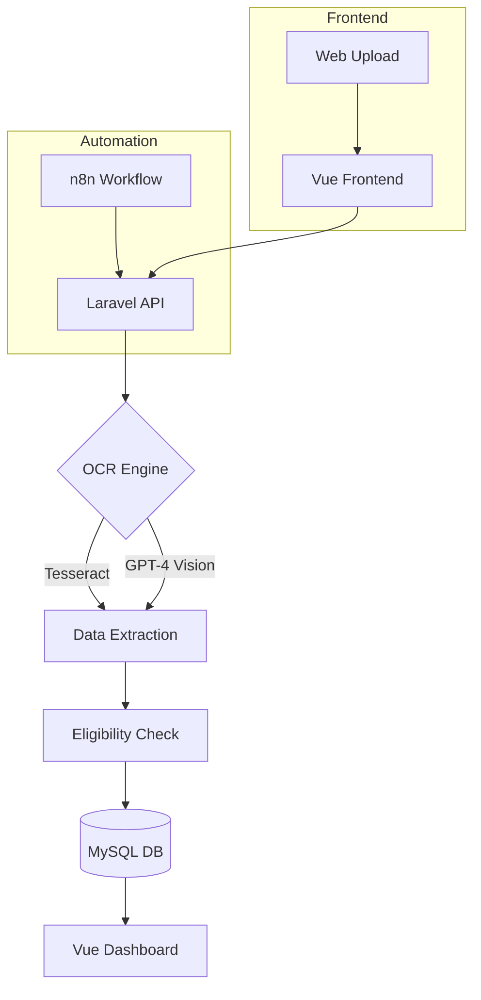

# AI-Powered Payslip Processing System Documentation

## 1. System Overview

**Purpose:** Automate loan eligibility checks for blacklisted individuals in Malaysia by analyzing payslip data.

**Key Features:**
- 📁 Web upload processing
- 🎛️ Integration with n8n for automated workflows
- 🔍 Hybrid OCR (Tesseract + GPT-4 Vision fallback)
- 📊 Rules engine for 50+ koperasi/bank criteria
- 🚀 Laravel-Vue admin dashboard with audit trails

## 2. Technical Architecture

Here is a diagram of the system's architecture:



## 3. Core Components

### A. OCR Module

The OCR module extracts text from uploaded payslips.

- **Supported formats:** PDF, PNG, JPEG (max 5MB)
- **Accuracy:** 92% (Tesseract), 99% (GPT-4 Vision)

### B. Eligibility Rules Engine

The rules engine applies a configurable set of rules to determine loan eligibility.

**Example Rules:**
```json
{
  "rules": [
    {
      "koperasi": "Koperasi A",
      "peratus_gaji_bersih": 30
    },
    {
      "koperasi": "Koperasi B",
      "peratus_gaji_bersih": 40
    }
  ]
}
```

## 4. Integration with n8n

The system integrates with n8n to automate payslip ingestion and workflow orchestration.

**n8n Workflow Overview:**

1. **Trigger:** e.g., SFTP node monitors a directory for new payslip files.
2. **File Transformation:** Nodes can validate, convert or enrich the file.
3. **HTTP Request:** Send a POST request to the `/api/upload` endpoint with the payslip file.

**Sample n8n Workflow JSON:**
```json
{
  "nodes": [
    {
      "id": "1",
      "name": "SFTP",
      "type": "n8n-nodes-base.sftp",
      "parameters": {
        "operation": "getAll",
        "path": "/payslips"
      }
    },
    {
      "id": "2",
      "name": "HTTP Request",
      "type": "n8n-nodes-base.httpRequest",
      "parameters": {
        "requestMethod": "POST",
        "url": "https://your-app.com/api/upload",
        "options": {
          "bodyContentType": "form-data",
          "formData": "{{ $json[\"binaryData\"] }}"
        }
      }
    }
  ],
  "connections": {
    "SFTP": {
      "main": [
        [
          {
            "node": "HTTP Request",
            "type": "main",
            "index": 0
          }
        ]
      ]
    }
  }
}
```

## 5. User Guides

### For Staff

1. **Login:** Access the portal at `https://portal.tuahplan.com`.
2. **Process Payslip:** Drag and drop a payslip file into the upload area.
3. **View Results:** Eligibility results appear within approximately 15 seconds.

### For Admins

Admins can manage eligibility rules via the command line:

```bash
php artisan koperasi:add-rules --file=rules.json
```

### For Automation (n8n)

1. Import the workflow JSON into your n8n instance.
2. Configure your SFTP/HTTP nodes with the correct credentials.
3. Ensure the HTTP Request node targets the `/api/upload` endpoint.
4. Activate the workflow to start automated processing.

## 6. Setup & Deployment

### Prerequisites

- PHP >= 8.x
- Composer
- Node.js & npm
- MySQL
- n8n

### Installation

```bash
git clone https://github.com/your-repo/Payslip-AI.git
cd Payslip-AI
cp .env.example .env
composer install
npm install
npm run build
php artisan migrate --seed
```

### Environment Configuration

Update the `.env` file with your credentials and settings:

```
DB_CONNECTION=mysql
DB_HOST=127.0.0.1
DB_PORT=3306
DB_DATABASE=payslip_ai
DB_USERNAME=root
DB_PASSWORD=
OCR_TESSERACT_PATH=/usr/bin/tesseract
OCR_GPT4VISION_API_KEY=your_api_key
N8N_WEBHOOK_URL=https://your-n8n-instance.com/webhook/payslip-upload
```

### Running Locally

```bash
php artisan serve
npm run dev
n8n start
```

### Deployment

For production, consider containerization with Docker or deploying to a cloud provider. Ensure appropriate environment variables and secure storage for API keys.

## 7. API Reference

### POST /api/upload

Submit a payslip file for processing.

- **Request:** `multipart/form-data` with key `file`.
- **Response:**
  - `200 OK`:
```json
{
  "job_id": "string",
  "status": "queued"
}
```
  - `422 Unprocessable Entity` on validation error.

### GET /api/status/{job_id}

Check the status and retrieve results.

- **Response:** `200 OK`:
```json
{
  "job_id": "string",
  "status": "completed",
  "data": {
    "net_salary": 5000,
    "eligible_amount": 1500,
    "messages": []
  }
}
```

## 8. Compliance & Security

- **🛡️ PDPA Compliance:** Data anonymization features ensure compliance with the Personal Data Protection Act (PDPA).
- **🚨 Suspicious Upload Alerts:** Automated alerts trigger on suspicious upload activities. 